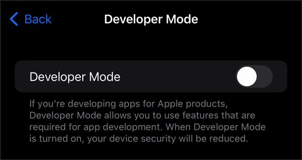

# Rusty-loc-sim

A command-line tool for simulating iOS device location on Windows systems.

## Table of Contents

- [Installation](#installation)
- [Usage](#usage)
- [Development Setup](#development-setup)
- [License](#license)
- [Support](#support)
- [Changelog](#changelog)
- [Acknowledgments](#acknowledgments)
- [Disclaimer](#disclaimer)

## Installation

### Prerequisites

- Windows 10 or later
- iTunes or Apple Mobile Device Support installed
- iOS device (recent version)

### Download

Download the latest release from the [Releases](https://github.com/yourusername/rusty-loc-sim/releases) page.

### Build from Source

```bash
# Clone the repository
git clone https://github.com/yourusername/rusty-loc-sim.git
cd rusty-loc-sim

# Build the project
cargo build --release

# The binary will be available at target/release/rusty-loc-sim.exe
```

## Usage

### Basic Usage

**IMPORTANT:** For the program to work, you need to download `wintun.dll`. You can get it from the official website [here](https://www.wintun.net/). And place it in the same directory as the executable.

Run the executable as administrator. If you cloned the repo, run `cargo run` from an administrator terminal. This is required because `wintun.dll` needs admin privileges to access the network hardware.

If you haven't enabled developer mode on your device, you can do it as follows:

```bash
reveal-developer-mode
```

Now, go to your device settings and search for developer mode. Enable it:



You can't connect to the device without enabling developer mode.

#### Connect your device via USB and run `connect` to establish a connection:

```bash
connect
```

#### Now, if no errors occurred, you are ready to start simulating:

```bash
simulate-location --lat 40.7128 --lng -74.0060
```

To reset the location, simply reboot your device.

### Command Line Options

```
   ____             __              __                    _____ _
   / __ \__  _______/ /___  __      / /   ____  _____     / ___/(_)___ ___
  / /_/ / / / / ___/ __/ / / /_____/ /   / __ \/ ___/_____\__ \/ / __ `__ \
 / _, _/ /_/ (__  ) /_/ /_/ /_____/ /___/ /_/ / /__/_____/__/ / / / / / / /
/_/ |_|\__,_/____/\__/\__, /     /_____/\____/\___/     /____/_/_/ /_/ /_/
                     /____/

rustymobiledevice CLI
Commands:
  connect                Connect to device
  reveal-developer-mode  Reveals Ios developer mode
  simulate-location -lat <latitude> -lng <longitude>
                         Simulate device location
  exit | quit            Exit the CLI
```

## Development Setup

1. Install Rust (1.70.0 or later)
2. Clone the repository
3. Run `cargo run` to ensure everything works
4. Make your changes
5. Submit a pull request

## License

This project is licensed under the GNU GPLv3 License. See the [LICENSE](LICENSE) file for details.

## Support

- 🐛 [Bug Reports](https://github.com/yourusername/rusty-loc-sim/issues)
- 💬 [Discussions](https://github.com/yourusername/rusty-loc-sim/discussions)


## Acknowledgments

- Thanks to the libimobiledevice project for iOS device communication protocols

## Disclaimer

This tool is intended for development and testing purposes only. Users are responsible for complying with all applicable laws and regulations. The developers are not responsible for any misuse of this software.

---

**Note**: This project is not affiliated with Apple Inc. iOS is a trademark of Apple Inc.
